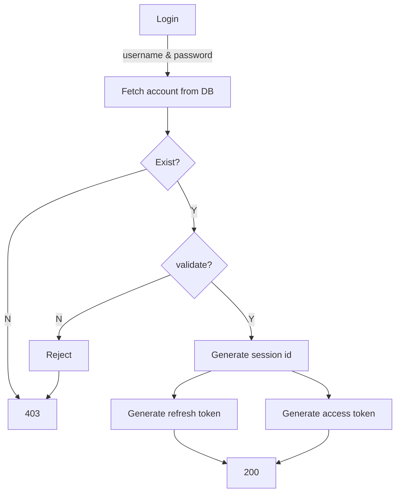
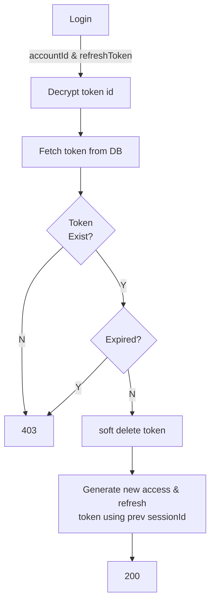
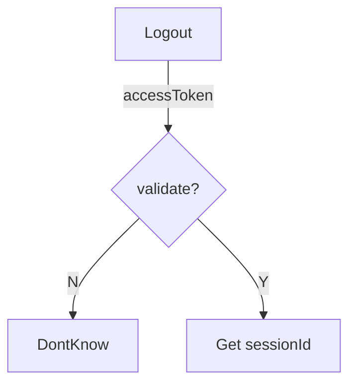

## Registration

/login

```mermaid
graph TD
    Login --> |username & password| F[Fetch account from DB]
    F --> E{Exist?}
    E --> |Y| V{validate?}
    E --> |N| 403
    V --> |Y| GenSession[Generate session id]
    V --> |N| Reject
    GenSession --> GenRefreshToken[Generate refresh token]
    GenSession --> GenAccessToken[Generate access token]
    GenRefreshToken --> 200
    GenAccessToken --> 200
    Reject --> 403
```

/refresh

```mermaid
graph TD
    Login --> |accountId & refreshToken| Decrypt[Decrypt token id]
    Decrypt --> F[Fetch token from DB]
    F --> TokenExist{Token<br>Exist?}
    TokenExist --> |Y| ExpireCheck{Expired?}
    TokenExist --> |N| 403
    ExpireCheck --> |Y| 403
    ExpireCheck --> |N| DeleteToken[soft delete token]
    DeleteToken --> GenNewToken[Generate new access & refresh<br>token using prev sessionId]
    GenNewToken --> 200
```

/logout

```mermaid
graph TD
    Logout --> |accessToken| validateToken{validate?}
    validateToken --> |N| DontKnow
    validateToken --> |Y| getSession[Get sessionId]

```